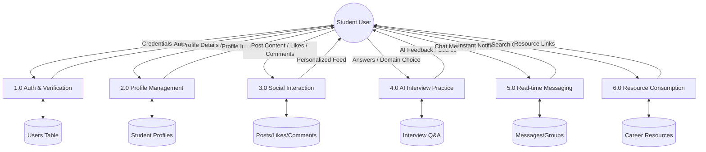
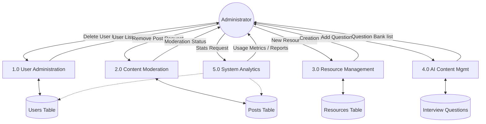

# UniConnect Level 1 Data Flow Diagrams

This document provides the Level 1 Data Flow Diagrams (DFDs) for both the **User (Student)** and **Admin** roles within the UniConnect platform.

---

## 1. Level 1 DFD: User (Student)

The Student DFD focuses on career development, social interaction, and real-time communication.

---

## 2. Level 1 DFD: Admin

The Admin DFD focuses on system moderation, management of resources, and monitoring.

---

### Description of Components

#### For User (Student):
- **Auth & Verification**: Handles secure login, registration, and OTP-based email verification.
- **Profile Management**: Allows students to build their professional identity with skills and resumes.
- **AI Interview Practice**: Integration with Gemini AI to provide mock interviews and scoring.
- **Social Interaction**: The core networking aspect where users share career-related updates.

#### For Admin:
- **User Administration**: Capabilities to manage user accounts and handles reports.
- **Resource Management**: Curating external career links for students.
- **AI Content Mgmt**: Managing the pool of domain-specific questions used by the AI engine.
- **System Analytics**: Providing a high-level overview of platform engagement.
