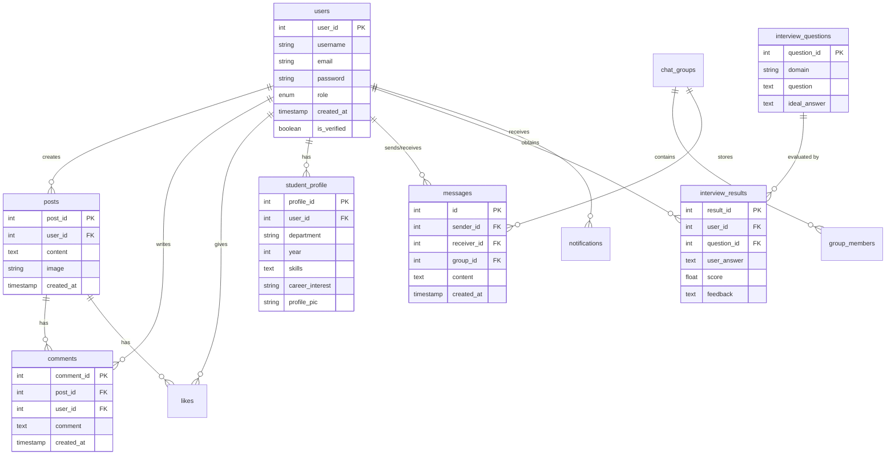

# UniConnect Project Documentation

## 📝 Synopsis
**UniConnect** is a student-centric professional networking and career development platform. It bridges the gap between academic learning and industry readiness by providing students with AI-powered tools for interview preparation, a collaborative space for sharing resources, and real-time networking capabilities. The platform enables students to create professional profiles, engage in peer-to-peer or group discussions, and access curated career content.

---

## 🛠 Technology Stack

### Frontend
- **Framework**: React 18 (Vite)
- **Styling**: Tailwind CSS 4.0 (Modern, utility-first CSS)
- **State Management & Routing**: React Router 7
- **Icons**: Lucide React
- **Data Visualization**: Chart.js & React-Chartjs-2
- **API Client**: Axios

### Backend
- **Runtime**: Node.js
- **Framework**: Express.js
- **Real-time**: Socket.io (for instant messaging and notifications)
- **Authentication**: JSON Web Tokens (JWT) & Bcrypt.js (password hashing)
- **File Handling**: Multer (for profile pictures and resumes)
- **Email Service**: Nodemailer (OTP-based verification)

### Database
- **Engine**: MySQL
- **Driver**: mysql2
- **Schema Management**: SQL-based structured data

### AI Integration
- **Engine**: Google Generative AI (Gemini Flash/Pro models)
- **Use Case**: Generating domain-specific interview questions, scoring user answers, and providing constructive feedback.

---

## ⚙ Methodology
The project follows a **Modular Monolith** architecture with a clear separation of concerns using the **Model-View-Controller (MVC)** design pattern on the backend.

1.  **Agile Development**: The project was developed iteratively, focusing on core authentication first, followed by social features (posts, comments), and finally the AI-driven career services.
2.  **Stateless API Design**: The backend communicates with the frontend via RESTful endpoints, ensuring scalability and easy debugging.
3.  **Event-Driven Communication**: Real-time features like chat and notifications utilize WebSockets (Socket.io) to provide a responsive user experience.
4.  **AI-Assisted Evaluation**: Methodology includes a prompt-engineering layer that sanitizes user input before processing it through the Gemini API to ensure relevant and high-quality feedback.

---

## 📊 ER Diagram

---

## 🗄 Database Table Schemas

### 1. `users`
Stores core user authentication and identification data.
| Field | Type | Description |
|---|---|---|
| `user_id` | INT (PK) | Unique identifier for each user |
| `username` | VARCHAR | User's display name |
| `email` | VARCHAR | Unique email address |
| `password` | VARCHAR | Hashed password |
| `role` | ENUM | 'student' or 'admin' |
| `is_verified` | BOOLEAN | Account verification status |

### 2. `student_profile`
Extended profile information for student users.
| Field | Type | Description |
|---|---|---|
| `profile_id` | INT (PK) | Unique identifier |
| `user_id` | INT (FK) | Reference to `users` |
| `department` | VARCHAR | Academic department |
| `skills` | TEXT | List of user skills |
| `resume` | VARCHAR | Path to uploaded resume |

### 3. `posts` & `comments`
Social interaction data.
| Field | Type | Description |
|---|---|---|
| `post_id` | INT (PK) | Unique post identifier |
| `user_id` | INT (FK) | Author of the post |
| `content` | TEXT | Text content of the post |
| `comment` | TEXT | Text content of the comment |

### 4. `interview_questions` & `results`
AI-driven interview module data.
| Field | Type | Description |
|---|---|---|
| `question_id` | INT (PK) | Unique question identifier |
| `domain` | VARCHAR | Domain (e.g., Frontend, Java) |
| `score` | FLOAT | AI-calculated score for the answer |
| `feedback` | TEXT | Detailed AI feedback |

### 5. `messages` & `chat_groups`
Communication data.
| Field | Type | Description |
|---|---|---|
| `id` | INT (PK) | Message identifier |
| `sender_id` | INT (FK) | Message sender |
| `content` | TEXT | Message body |
| `group_id` | INT (FK) | Reference to chat group (null for direct messages) |
